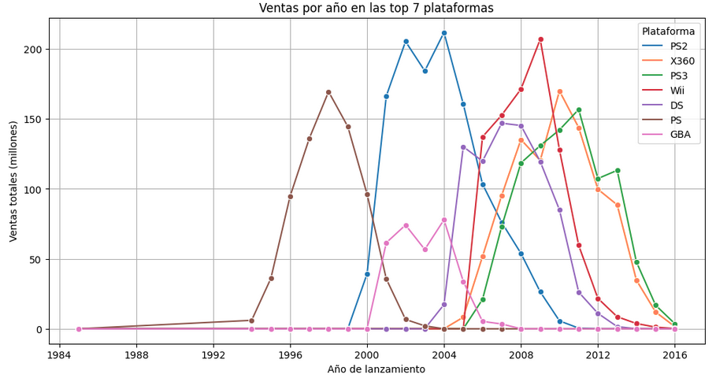
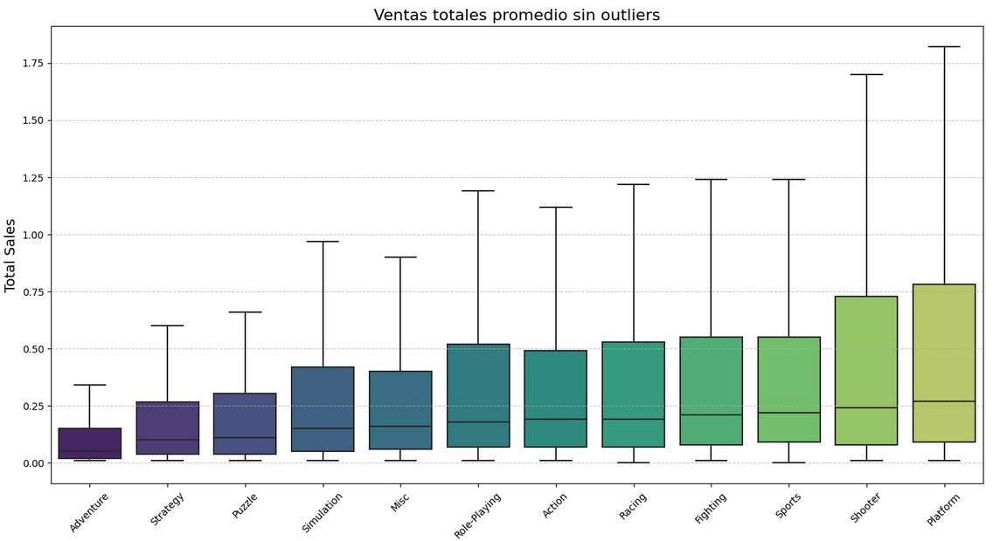

# An-lisis-de-ventas-de-videojuegos-y-perfil-de-usuarios-TripleTen-Project-
Este proyecto forma parte de una actividad de aprendizaje del bootcamp de análisis de datos de **TripleTen**.

Este proyecto forma parte de una actividad de aprendizaje del bootcamp de análisis de datos de **TripleTen**.

El objetivo es estudiar datos de ventas, plataformas, géneros y reseñas de videojuegos para:
- Identificar patrones de éxito en videojuegos
- Determinar qué plataformas y géneros dominan en diferentes regiones (NA, UE, JP)
- Establecer recomendaciones para campañas publicitarias para el año 2017
- Poner en práctica limpieza de datos, análisis exploratorio y pruebas de hipótesis

Este proyecto muestra gráficos como las ventas seg'un el género para cada región de los Estados Unidos.


También muestra las ventas promedio por año en todo el mundo


Y las ventas totales según el género en todo el mundo.


Esto con el fin de comparar los diferentes patrones que puedan presentarse entre las principales regiones consumidoras y el promedio mundial.

## 📁 Estructura del proyecto

- `games_analysis.ipynb`: notebook de Jupyter que contiene todo el análisis y los gráficos
- `datasets/games.csv`: dataset original (ventas globales de videojuegos con ratings y reseñas)
- `README.md`: este archivo
- `requirements.txt`: lista de paquetes usados en el análisis

## 🧪 Tecnologías y herramientas utilizadas

- Python (Pandas, NumPy, Matplotlib, Seaborn, SciPy)
- Jupyter Notebook
- Análisis estadístico y pruebas de hipótesis (t-test, correlaciones)
- Visualización de datos
- Limpieza de datos faltantes y conversión de tipos

## 📌 Etapas del análisis

1. **Preparación de datos**
   - Conversión de tipos
   - Tratamiento de valores faltantes y valores como `'TBD'`
   - Cálculo de ventas totales por juego

2. **Análisis exploratorio**
   - Evolución de lanzamientos por año
   - Comparación de ventas por plataforma
   - Evaluación de popularidad por género y región

3. **Perfil de usuario por región**
   - Análisis de plataformas y géneros más vendidos en NA, EU, JP
   - Efecto de la clasificación ESRB en ventas regionales

4. **Pruebas de hipótesis**
   - Comparación de calificaciones de usuarios entre plataformas
   - Comparación entre géneros (acción vs deportes)

## ⚠️ Notas

- El dataset fue proporcionado por TripleTen y se asume que es de uso educativo.
- Si no tienes acceso al archivo `games.csv`, puedes editar el notebook para usar tu propio dataset o pedir acceso en la plataforma.

## ✅ Cómo correr el proyecto

```bash
# Clona el repositorio
git clone https://github.com/tuusuario/tu-repo.git
cd tu-repo

# (Opcional) Activa un entorno virtual y instala dependencias
pip install -r requirements.txt

# Abre el notebook
jupyter notebook games_analysis.ipynb
